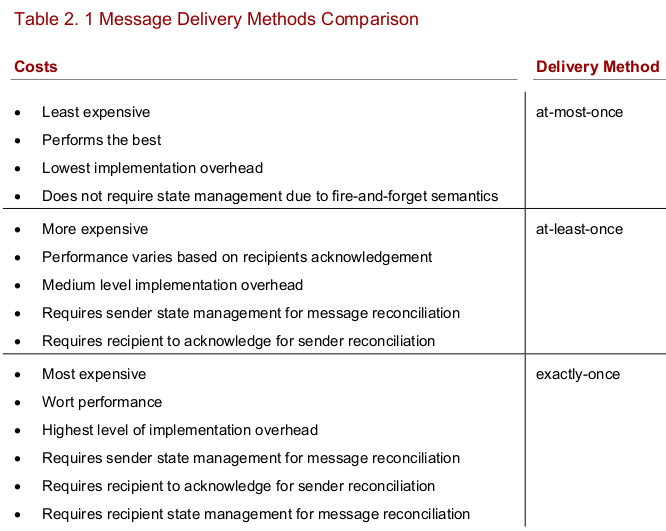

#Actor Model

##What is it?
Actors are small capsules of programming logic that
contain behavior and state, and communicate via message passing

The primary purpose behind an actor is to provide two concepts:
* A safe, efficient way to reason about computations in a concurrent environment, and
* A common means to communicate in a local, parallel, and distributed environment.

Components:
* State
* Actor reference
* Asynchronous message passing
* Mailbox
* Behavior and the Receive loop
* Supervision

##State
Akka isolates each actor on a light-weight thread that protects it from the rest
of the system.
The actors themselves (housed inside a light-weight thread) run on a real set of
threads, where a single thread may house many actors with subsequent invocations for a
given actor occurring on a different thread

##Actor reference
Akka's approach is to designate instaces of actors known as **ActorRef**. Using **ActorRef** results in a single API for both local and remote.
 * immutable
 * handle to it is serializable
 * maybe local or on a remote system
 * Acts as a proxy for the actor it represents

The proxy behavior makes it possible to send it over the wire on behalf of its actor.
When an actor recieves an **ActorRef** the location of the real actor is transparent.

###Async Message Passing
Using asynchronous message passing semantics, actors interact with one another by sending a messages to each other’s ActorRef. 

###Support for two operators:
 * **!** or *tell*: send a message asynchronously. *fire-and-forget*
 * **?** ir *ask*: send a message asynchronously and expect a reply. *Future*

###Akka message passing semantics:
 * *at-most-once* delivery
 * *message ordering per sender-receiver pair*

**At-most-once**: For each message handled, it will arrive at the recipient zero or one times. (Inference: During transfer the message can get lost)

**At-least-once**: For each mesage handled, multiple attempts may occur until delivery is successful. (Inference: recipient may receive duplica messages)

**Exactly-once**: For each message handled, the recipient will recieve 1-and-only-1 copy. (Inference: The message will not be lost or duplicated)



###The Mailbox
* Each actor has exactly one mailbox that enqueues all messages in the order received. 
* For a given sender, the recipient will always receive the messages sent in the proper order.
* If a single recipient receives messages from multiple senders, due to the randomness of threading, the messages in aggregate may be interleaved. 

**the recipient will always receive messages in order from a given sender**
**When there are multiple senders, as the figure shows, that interleaving can occur. **
 
###Behavior and The Recieve Loop
Each time an actor receives a message, it’s processed against its behavior in a method known as the receive loop.

###Supervision
Akka allows any actor to create child actors for the purposes of delegating sub-tasks. In this context, the spawning actor becomes known as a supervisor and has authority over the
children.

**fault tolerance** is defined as an aspect of the system that allows continued operation in the event of failure of some of its components. 

**Resilience** means reacting to failure by springing back into shape

##The Actor System
very real actor within the actor system has to have a supervisor.

###ROOT Guardian
At the top of the actor stack is root guardian who must have a supervisor as well. Ultra-top-level is a **syncthetic ActorRef** which manages the root guardian.

*isTerminated* flag shutdowns the system.

###Top-Level Actors

*/:* The Root Guardian - CEO of the actor system, basicly God.

*/user:* The Guardian - parent of all user-created actors **system.actorOf()**. You may escalate issues to CEO.

*/system:* The System Guardian - special actor that an orderly shutdown sequence

*/deadletters:* The Graveyard Guardian - is a special
guardian where all messages sent to stopped or non-existent actors go.

*/temp:* The Temp Guardian - short lived stuff goes here

*/remote* The Remote Guardian - for the supervisors reside on a remote systems

##Supervision

OneForOneStrategy: Self explanatory.
AllForOneStrategy: Default strategy. The supervisor will execute one of the 4 directive not only against the subordinate that faulted, but also against
all subordinates the supervisor manages.

1. Resume
2. Restart
3. Stop
4. Escalate

###Actor Path
Accessing an actor system:
```
akka://bookstore/user/order/worker-1				 // local
akka.tcp://bookstore@host.bookstore.com:5154/user/order/worker-2 // remote
```
Lookup an actor
* relative       - ActorSystem.actorSelection
* absolute paths - ActorContext.actorSelection

actorSelection - sending a message to an actor directly
```
context.actorSelection("../worker-1) ! msg	     // relative
context.actorSelection("/user/order/worker-1") ! msg // absolute
```

To create an actor, you use **ActorSystem.actorOf** or **ActorContext.actorOf**

**ActorSystem.actorOf** - used when starting thr system
**ActorContext.actorOf** - used when already created actors

Not needs Props **actorSelection** 
Needs **actorOf** Props
**Props** - immutable class for specifying options for actor creation
```
class Manager extends Actor {
 context.actorOf(Prop[Worker], "worker-1")
}
```
Best practice: Use a Props factory
```
object Worker {
  def props = Props[Worker]
}

class Worker extends Actor {
  def receive = {
    case order:Order => // do something ...
    // other code ...
  }
}

class Manager extends Actor {
  context.actorOf(Worker.props, “worker-1”)
  // other code ...
}
```
###Actor Lifecycle

####Starting
Occurs if & only if acotr is started or whn restarted by supervisor
* **actorOf** is called
* the actor path is reserved
* a UID is assigned to the actor instance
* the instance is created
* preStart() method is called on the actor instance

####Stopping
* **Stop**, **context.stop()** or **PosionPill**
* **postStop()** is called on the actor
* the actor is terminated
* the acot path is now usable

####Restarting
When a supervisor restarts an actor
* **postRestart()** is called o nthe actor
* old actor instance is asked to stop with **Stop** 
* **postStop()** old actor instance
* the actor path of the old instance is reserved for the new instance
* the UID of the old instance is reserved for the new instance
* the old actor instance is terminated
* **preStart()** is called on the new instance
* new actor instance is started

###Microkernel Container
The runtime in Akka, the microkernel, is designed and optimized to offer a bundling mechanism
that allows single payload distribution atop the JVM without the need for an application
container or startup script

page cahpter3
